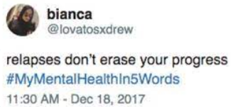

# Factors Related to Twitter Engagement in Anxiety Support Seeking

Authors: Yingchen Ma, Anuraag Govindarajan, Thomas Macheras, Elisabeth Petit-Bois

## Introduction / motivation

Twitter, one of the most popular social media sites in the world, is an online space in which individuals come to express their perspectives and share their experiences. In a time where mental health is an increasingly less taboo topic, a large collection of Twitter users regularly use the site to share their mental health struggles and connect with others for support.

In this project, **we investigate how the sentiment and volume of the response to tweets related to anxiety are influenced by various poster-controllable textual attributes.** These attributes include presence of hashtags, profanity, positive/negative sentiment, etc. Example questions include: are people more likely to respond to a mental illness tweet positively or more supportively if the user includes a hashtag in their tweet? A swear word? Phrases what they want to say in a particular way?

Answering such questions could yield benefits to users who are seeking anxiety-related help on social media platforms, as it can give them information about how to formulate their posts to best increase their oddds of receiving a larger and/or more positive response.

## Summary of contributions

Full descriptions of the project motivation, methodology, findings, and future directions can be found in the presentation and report `.pdf` files in the `docs/` folder. Below, we provide a high-level summary.

Our primary contributions to this project are threefold:
1. Collect a large-scale Twitter dataset of anxiety support-seeking tweets and replies to them.
    - Our final dataset consists of 42569 of these tweets and 51414 replies to these tweets, and ranges from 2009 to 2022.
2. Investigate tweet features and their relationship to the volume of engagement received for the tweet.
    - We train a Linear Regression model with a variety of tweet textual data and metadata as the features (e.g. VADER sentiment, presence of hashtags, presence of swear words, time of day posted, etc.), and a function of number of likes, replies, retweets, and quote tweets (which we call an "interaction score") as the label.
    - We find that positive sentiment, negative sentiment, and user mentions have significant positive corrrelations with engagement, while the presence of swear words / profanity has significant negative correlation with engagement.
3. Investigate tweet features and their relationship to the sentiment of replies received for the tweet.
    - We train a Linear SVM with sentiment of the reply as the label (0 = negative, 1 = positive), and the same variables in Contribution 2 as the features.
    - We find that positive sentiment and presence of hashtag have significant positive correlations with reply sentiment, while negative sentiment and the presence of swear words / profanity have significant negative engagement with reply sentiment.

## Directory structure

* `data/`: folder to store data.
* `docs/`: folder for presentations, reports, and other media.
* `scripts/data_scripts/`: folder for scripts related to data retrieval / preprocessing.
* `notebooks/`: folder for Jupyter notebooks for analysis.
